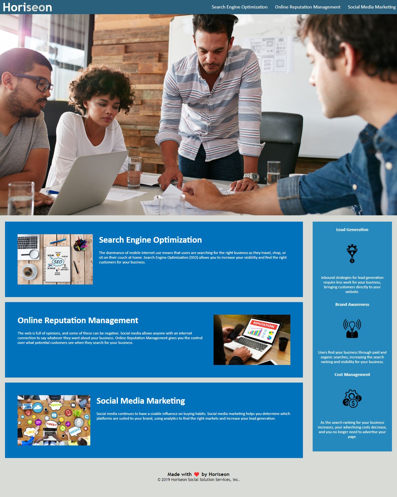

<# 02-Challenge-Week1HW-Chris-Kang>

deployed site - https://kjman26.github.io 

02-Challenge-Week1HW-Chris-Kang/
Description: website dedicated to helping business market digitally.

This site was edited to correct redundancies and accessibility issues.

This site solves the issue of redundancy and accessibiity for all.

I learned more than I can recount, however to name a few: 

1. <div> is very useful and can be used in tons of situations 
2. <div> can be replaced by a number of semantic tags that make the html easier to read and understand for the outside users
3. Redundancies are easy to commit especially in CSS
4. Attention to detail can make or break the website
5. Accessibility must always be addressed

#Installation: none

 ```md
    
    ```
##Credits
    HUGE shout out to Joe and the TA's! 
    
Zoom:
6-16: https://applications.zoom.us/lti/rich/home/recording/detail
6-15:https://applications.zoom.us/lti/rich/home/recording/detail
6-14: https://applications.zoom.us/lti/rich/home/recording/detail
